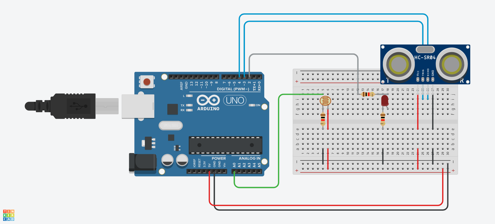
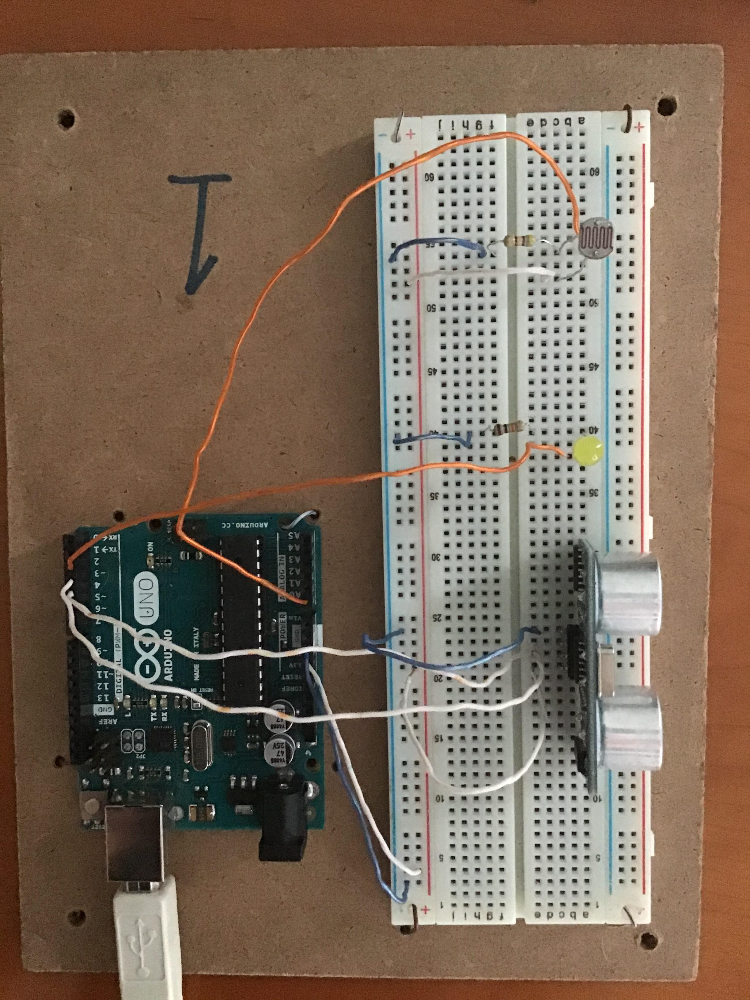

# Arduino Night Light

This project is a simple implementation of a night light using Arduino technology. The LED light automatically turns on when it is sufficiently dark (determined by the photoresistor). The night light can be activated or deactivated by hovering your hand over the ultrasonic sensor. When it is deactivated, the LED will be off regardless of the brightness.

## Gallery

